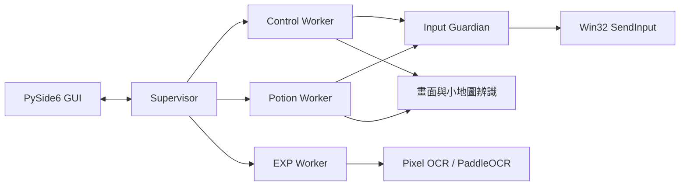

# MapleStar

[](https://github.com/abc57911/maple-star-assistant/actions/workflows/release.yml)


MapleStar 是為 **MapleStory Worlds** 設計的 Windows 桌面自動化輔助工具。專案聚焦多程序執行、畫面辨識、即時排程與失效安全的輸入控制。

## 核心功能

| 功能 | 說明 |
| --- | --- |
| HP／MP 自動補充 | 解析 HUD 狀態條，依門檻、冷卻與藥水效果決定輸入時機。 |
| EXP 效率追蹤 | 以 Pixel OCR 為主、PaddleOCR 為 fallback，計算經驗增量、每小時效率與升級預估。 |
| 手把巨集 | 支援 RB／LB 組合、週期鍵與可設定的控制器按鈕。 |
| 小地圖巡航 | 追蹤角色位置、控制移動邊界，並處理復位與技能節奏。 |
| 安全偵測 | 遊戲失焦、測謊視窗、其他玩家或 runtime 異常時暫停自動化並釋放按鍵。 |
| 通知與診斷 | 提供可選的 Telegram 通知、結構化記錄與 GUI 診斷資訊。 |

## 工程亮點

- **受監督的多程序架構**：GUI、控制、藥水與 EXP worker 透過 bounded IPC 協作，由 supervisor 管理生命週期與健康狀態。
- **單一輸入寫入者**：Input Guardian 統一執行鍵盤與滑鼠輸入，搭配 foreground guard、generation fence 與緊急停止，避免失控輸入。
- **雙路徑 OCR**：快速 Pixel OCR 處理主要流程，PaddleOCR 負責低信心 fallback；continuity guard 保留最近可信結果。
- **即時與效能設計**：使用絕對 deadline 排程、狀態簽章去重、bounded queue 與 GUI lazy build，降低延遲及重繪成本。

## 架構概覽



## 技術棧

- Python 3.11、PySide6、multiprocessing
- Win32 API、GDI、SendInput、Windows Job Object
- OpenCV、NumPy、MSS、PaddleOCR
- pygame-ce／SDL controller
- unittest、PyInstaller、GitHub Actions

## 快速開始

### 使用 Release

從 [GitHub Releases](https://github.com/abc57911/maple-star-assistant/releases/latest) 下載 `MapleStar.zip`，解壓縮後執行 `MapleStar.exe`。

### 從原始碼執行

需求：Windows 10／11 x64、CPython 3.11 x64。

```powershell
py -3.11 -m venv .venv-paddleocr
.\.venv-paddleocr\Scripts\python.exe -m pip install -r requirements.txt
.\run_maple_star.bat
```

首次初始化 PaddleOCR 模型需要網路。完整環境重建流程請見[安裝文件](docs/installation.md)。

## 品質與驗證

專案包含 82 個測試模組，並依變更範圍提供快速、完整、OCR 與效能驗證。Release workflow 會執行編譯、完整測試、依賴檢查、PyInstaller 打包及 ZIP 結構驗證。

```powershell
python tools\verify.py
python tools\verify.py full
```

## 專案結構

| 路徑 | 職責 |
| --- | --- |
| `maple_star/views_qt/` | PySide6 GUI 與畫面模型。 |
| `maple_star/controllers/` | 應用流程與 runtime orchestration。 |
| `maple_star/services/` | OCR、偵測、排程、設定與領域邏輯。 |
| `maple_star/adapters/` | Win32、輸入、視窗及外部系統邊界。 |
| `maple_star/backend/`、`maple_star/workers/` | Supervisor、IPC 與背景 worker。 |
| `tests/`、`tools/` | Regression fixtures、測試與驗證工具。 |

更多設計細節請見[文件索引](docs/INDEX.md)、[專案結構](docs/project-structure.md)與[驗證流程](docs/verification.md)。

## 使用責任

本專案是個人技術實作，與 MapleStory Worlds 或其營運團隊無關。使用者應自行確認並遵守適用的服務條款；自動化功能預設以目標視窗、HUD 狀態與安全停止機制限制輸入範圍。
